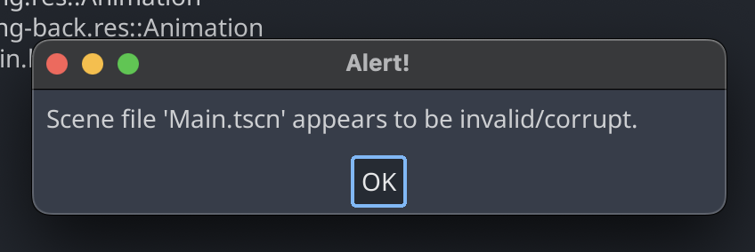
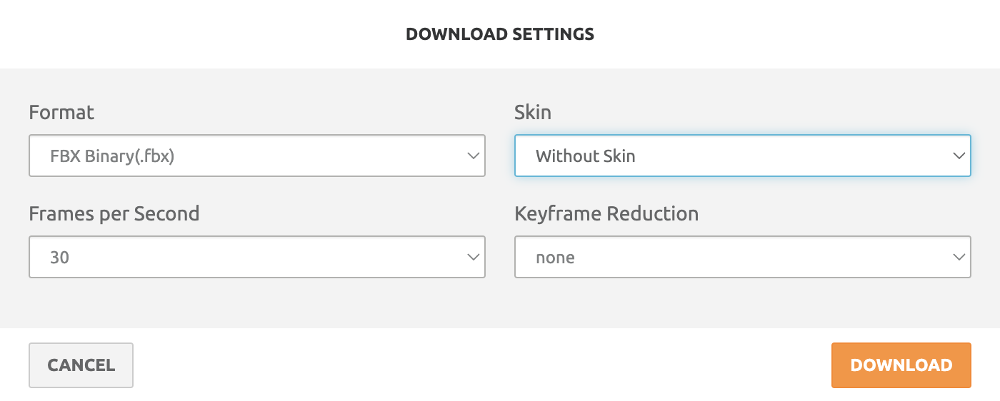

Some time ago I posted a video of my omnidirectional movement demo in Godot on Reddit:

https://github.com/filipkrw/godot-omnidirectional-movement/assets/34350914/e0c4ec87-f50d-4c54-98f2-20b1e1c2df21

People seemed to like it and were interested to learn how I made it – hence this repo. Unfortunately, while the model and animations I used (sourced from [Mixamo](https://www.mixamo.com/)) are free to use, they are not free to redistribute.

That's why they are not included in this repo (all the `.blend` files are empty) and instead what you get is a guide on where to get them, and how to tweak them to make the demo work. Which might be even better since the best way to learn something is to do it.

Feel free create a GitHub issue or send me an email at filipkrw@protonmail.com if you have any questions.

# Intro

This is a C# Godot project so you'll need to get the correct Godot version. There's not much code so you should be able to translate it easily to GDScript if you prefer it. ChatGPT can probably be able to do that for you.

You'll also need Blender to tweak the assets.

# The model

The project has two main scenes: `Main.tscn` and `Mannequin.tscn`, but without the character model they won't open:

Get the model from Mixamo. I used [Y Bot](https://www.mixamo.com/#/?page=1&query=Y+Bot&type=Character), but they all share the same skeleton, so feel free to pick a model you like. Download it in FBX Binary(.fbx) format and T-Pose.

Open the empty `assets/models/mannequin.blend` file in Blender, import the FBX model, delete the animation and save it.

https://github.com/filipkrw/godot-omnidirectional-movement/assets/34350914/2f900954-b8f8-43a4-bdfb-507b14f3214e

You should be able to open the scenes now.

# The animations

We'll need to set-up 9 animations.

## Idle

Mixamo won't let me link to a specific animation so here's a link to filtered search results: https://www.mixamo.com/#/?page=1&query=Idle&type=Motion%2CMotionPack. Download the sensible looking idle animation (should be in the second row) using these settings:

Open `assets/animations/idle.blend` file, import the FBX animation and save it. I also rename the animations to make it easier to work with them inside Godot, but that's not strictly necessary.

https://github.com/filipkrw/godot-omnidirectional-movement/assets/34350914/a2f094df-dfed-47d3-8a6a-b6a2110c97d1

In Godot, double click `assets/animations/idle.blend` file and reimport the animation as a spearate file: `assets/animations/idle.res`. Next, add the animation to the `AnimationPlayer` in `Mannequin.tscn` scene and enable animation looping.

https://github.com/filipkrw/godot-omnidirectional-movement/assets/34350914/e3ce6220-8955-4d65-a76e-3ead71701f45

## Running and strafing

Download the animations below. Select the "In place" checkbox when available and use the same download settings as before.

- `running.blend` – https://www.mixamo.com/#/?page=1&query=running+with+intention&type=Motion%2CMotionPack
- `running-back.blend` – https://mixamo.com/#/?page=1&query=running+backward&type=Motion%2CMotionPack (should be the first one)
- `right-strafe.blend` – https://www.mixamo.com/#/?page=1&query=running+strafe+to+the+right&type=Motion%2CMotionPack
- `left-strafe.blend` – https://www.mixamo.com/#/?page=1&query=running+strafe+to+the+left&type=Motion%2CMotionPack (should be the second one)

They all need to be stretched in Blender to be exactly 2 seconds long or the won't blend seamlessly.

Open the corresponding Blender files, import FBX animations and rename them if you wish. Next, **hover over the Timeline panel on the bottom** (very important to actually hover over the panel), press A to select all frames, press S for scale, and drag your mouse to the right until the last keyframe is on the 60th frame.

https://github.com/filipkrw/godot-omnidirectional-movement/assets/34350914/0b9ffeec-a1cf-4b47-b1aa-565b08a71d39

Repeat for all animations in the list and import them into Godot like the idle animations.

## Diagonals

Diagonal animations are a bit more tricky for two reasons:

1. Only the forward-left and backward-right animations in Mixamo are set-up correctly. Their opposites don't respect the "In place" setting – they slide in a weird way.
2. animations start on the left foot when the rest of the animations start on the right one.

We can remedy the first problem by mirroring the animations to get the front-right and the backward-left, and the second one by trimming the animations so they start on the right foot using the trim slider in Mixamo download settings.

Here are the correct download settings for the animations. Select "In Place" and change only the parameters specified in brackets, leaving the rest as default. Make sure the animation starts on the right foot before downloading.

- `jog-forward-right.blend` – https://www.mixamo.com/#/?page=1&query=jog+diagonal+forward+right&type=Motion%2CMotionPack (trim -50 to 50)
- `jog-forward-left.blend` – https://www.mixamo.com/#/?page=1&query=jog+diagonal+forward+right&type=Motion%2CMotionPack (mirror)
- `jog-backward-right.blend` – https://www.mixamo.com/#/?page=1&query=jog+diagonal+backward+right&type=Motion%2CMotionPack (trim -50 to 50)
- `jog-backward-left.blend` – https://www.mixamo.com/#/?page=1&query=jog+diagonal+backward+right&type=Motion%2CMotionPack (mirror)

Import them into Blender, stretch to 2 seconds, and import them into Godot.

# The game

You should now be able to have a play with the BlendSpace2D responsible for the animation blending. If that works, go ahead and run the project.

https://github.com/filipkrw/godot-omnidirectional-movement/assets/34350914/c14f28c1-e6b9-466b-8ccd-c65acfe94142

## Bonus: turn animations

You may have noticed that the mannequin slides when rotated in place. Turn animations need a bit more tweaking. I'll update this section soon with the instructions.

For now, here are the links to the animations so you can try to figure it out yourself:

- `right-turn.blend` – https://www.mixamo.com/#/?page=1&query=right+turn&type=Motion%2CMotionPack (should be the first one)
- `left-turn.blend` – https://www.mixamo.com/#/?page=1&query=left+turn&type=Motion%2CMotionPack (should be the first one)
